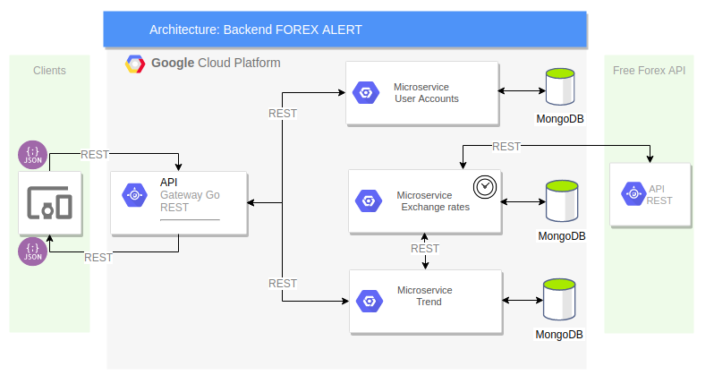

Proyecto CC: Sistema de cálculo de tendencias en el mercado de divisas
***
## Descripción del proyecto 
El objetivo de este proyecto es desarrollar un servicio en la nube que permita a inversionistas del mercado Forex consultar por las tendencias de los valores de las monedas en distintos periodos de tiempo. Entre las funcionalidades de este producto se encuentran:
1. Alta de usuarios: La aplicación permitirá crear, editar y eliminar cuentas de usuario.
2. Creación de base de datos de valores de divisas: El sistema contará con una BD actualizada con las tasas de cambio para los principales pares de divisas
3. Interfaz de consulta de tendencia: El sistema responderá a consultas de tendencias de las divisas para distintos períodos de tiempo. 

## Alcance
El alcance del proyecto es solo la construcción del backend del sistema. La información de las tasas de cambio se obtendrá de la API REST expuesta por Free Forex API que ofrece información actualizada cada 15 segundos.

## Arquitectura
La aplicación será desarrollada siguiendo una arquitectura de [microservicios](https://en.wikipedia.org/wiki/Microservices). Las peticiones de clientes serán recibidas por un API Gateway REST utilizando JSON. Dicho Gateway enrutará las peticiones al microservicio que corresponda. 
Se construirán 3 microservicios:
1. User Accounts: Responsable de la alta, modificación y baja de cuentas de usuario.
2. Exchanges Rates: Responsable de poblar la BD con valores de divisa en el tiempo. La información se obtendrá consultando la API REST de [Free Forex API](https://www.freeforexapi.com/) de manera agendada cada 15 segundos.
3. Trande: Responsable de calcular las tendencias de los valores de las divisas con la información provista por el microservicio “Exchange Rates” el que será consultado a través de API REST.

## Lenguaje
Los microservicios serán construidos en Python 3, debido a la gran cantidad de material de apoyo existente en la red y la facilidad que ofrece de implementar scripts.

## Base de datos
Para el almacenamiento se utilizará una BD NoSQL como mongoDB independiente para los servicios de cuentas de usuario y los valores de las divisas. Esto debido a que este motor de base de datos a sido de gran aceptación en las soluciones empresariales en los últimos años.

## Comunicación
Los microservicios se comunicarán mediante envío de mensajes REST JSON.
 
## Test
Para el desarrollo basado en test se aplicarán distintas pruebas en cada microservicio usando [PyTest](https://docs.pytest.org/en/latest/). 
 
## Servicios 
Cada microservicio generará log, para esto se usará logging y syslog para centralizar la información.

